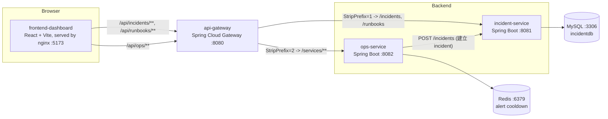

# 架構說明

本文件說明 OpsBoard Microservices Demo 的服務職責、服務間關係，以及一次 demo 流程背後實際發生的呼叫順序。

## 服務職責

| 服務 | Port | 職責 |
| --- | --- | --- |
| `frontend-dashboard` | 5173（容器內 nginx 80） | React + Vite + TypeScript 編譯後的靜態檔，由 nginx serve。提供 dashboard 首頁（服務卡片 + incident 列表）與 incident 詳情頁（狀態推進、timeline、runbook）。只透過 `api-gateway` 呼叫後端，不直連 8081/8082。 |
| `api-gateway` | 8080 | Spring Cloud Gateway，把 `/api/...` 路徑統一路由到 `incident-service` 或 `ops-service`，並處理 CORS。是前端唯一會打的後端入口。 |
| `incident-service` | 8081 | Spring Boot 3 + Spring Data JPA。負責 incident 的 CRUD、狀態機（OPEN → INVESTIGATING → MITIGATED → RESOLVED）、每次狀態變更自動記錄一筆 timeline，以及 runbook 查詢（依 `serviceName` 查 3 個監控服務各自的應變手冊）。資料持久化在 MySQL。 |
| `ops-service` | 8082 | Spring Boot 3。提供 3 個監控服務（`payment-api`、`checkout-api`、`notification-worker`）的健康狀態與隨機產生的（但符合健康/degraded 區間）指標快照，並提供 trigger-alert：用 Redis 做 60 秒 cooldown 控制，cooldown 未過期時拒絕重複觸發，cooldown 通過時呼叫 `incident-service` 建立一筆新 incident。 |
| `mysql` | 3306 | `incident-service` 的關聯式資料庫，儲存 incident、timeline entry、runbook 三張表。 |
| `redis` | 6379 | `ops-service` 的 alert cooldown 狀態儲存（key `alert:cooldown:<serviceName>`，TTL 60 秒）。 |

所有 port 都只綁定在 `127.0.0.1`，不對外網開放；服務間透過 Docker Compose 內部網路用服務名稱（`mysql`、`redis`、`incident-service`、`ops-service`）互相呼叫。

## 架構圖

## 主要 demo 流程的資料流

對照產品故事（見 `docs/demo-script.md`）的 8 個步驟，"按 Trigger Alert" 這一個動作背後實際發生的呼叫鏈如下：

1. 瀏覽器打開 `http://localhost:5173`，frontend 載入後呼叫：
   - `GET /api/ops/services/health`（經 gateway StripPrefix=2 轉成 `GET /services/health` 打到 ops-service）→ 回傳 3 張服務卡片的健康狀態。
   - 對每個服務再呼叫 `GET /api/ops/services/{serviceName}/metrics` 取得 latency/error rate/CPU 指標。
   - `GET /api/incidents`（經 gateway StripPrefix=1 轉成 `GET /incidents` 打到 incident-service）→ 取得目前的 incident 列表（初始為空）。
2. 使用者對 `checkout-api`（baseline 狀態為 DEGRADED，唯一會顯示 Trigger Alert 按鈕的卡片）按下 **Trigger Alert**：
   - frontend 呼叫 `POST /api/ops/services/checkout-api/trigger-alert`，經 gateway 轉送到 ops-service 的 `POST /services/checkout-api/trigger-alert`。
   - ops-service 先用 Redis `SETNX alert:cooldown:checkout-api 1 EX 60` 嘗試取得 cooldown 鎖：
     - 若鎖已存在（60 秒內已觸發過）→ 直接回 `409 Conflict`，不會呼叫 incident-service。
     - 若取得鎖成功 → 產生一份隨機指標快照，組成 `CreateIncidentRequest`，呼叫 `POST http://incident-service:8081/incidents` 建立一筆新 incident（severity 固定為 `HIGH`）。
   - incident-service 收到請求後寫入 MySQL 的 `incidents` 表，並在同一個 transaction 裡寫入第一筆 timeline entry（`fromStatus=null, toStatus=OPEN`），回傳 incident JSON。
   - ops-service 把這個 incident JSON 原封不動地包成 `201 Created` 回給 frontend。
3. frontend 收到 `201` 後重新呼叫 `GET /api/incidents`，新 incident 出現在列表中。
4. 使用者點進該 incident，frontend 並行呼叫 `GET /api/incidents/{id}`、`GET /api/incidents/{id}/timeline`，再用拿到的 `serviceName` 呼叫 `GET /api/runbooks?serviceName=checkout-api`，三者都打到 incident-service（不經過 ops-service）。
5. 使用者依序按「Mark as INVESTIGATING / MITIGATED / RESOLVED」按鈕：
   - 每次都呼叫 `PUT /api/incidents/{id}/status`，incident-service 驗證狀態機合法性後更新 incident 並寫入一筆新的 timeline entry，前端重新抓 incident + timeline 顯示最新狀態與多一筆紀錄。

整個流程裡，**Redis 只在 trigger-alert 這一步介入**（cooldown 判斷），其餘步驟（CRUD、timeline、runbook）完全是 incident-service 對 MySQL 的操作。

## 為什麼選 MySQL

`incident-service` 的核心資料是強結構化、有明確關聯的：一個 incident 對應多筆 timeline entry（一對多），加上需要依狀態欄位查詢、依建立時間排序列出。這類有清楚 schema、需要交易一致性（建立 incident 與寫入第一筆 timeline 在同一個 transaction 內）的資料，用關聯式資料庫（MySQL）儲存最直接；專案也已經用 Spring Data JPA + Hibernate 操作，搭配 MySQL 是最常見、最低learning curve 的組合，且 `ddl-auto: update` 讓 demo 環境不需要額外寫 migration script。

## 為什麼選 Redis

`ops-service` 的 alert cooldown 是**真實用途，不是裝飾**：它要解決「同一個服務在短時間內被重複觸發 alert、灌爆 incident 列表」的問題。這個需求的本質是一個有 TTL 的暫時性鎖（key `alert:cooldown:<serviceName>`，60 秒後自動失效），完全符合 Redis 的 `SETNX` + `EXPIRE`（程式碼裡用 `setIfAbsent(key, value, duration)` 一次完成）語意：不需要自己寫排程清理過期資料、不需要佔用 MySQL 的表空間存放這種短生命週期的狀態，而且查詢/寫入都是 O(1) 的記憶體操作，符合「擋住短時間內的重複請求」這種對延遲敏感的場景。
